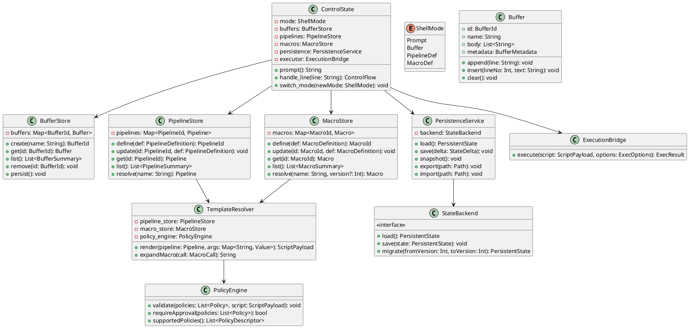
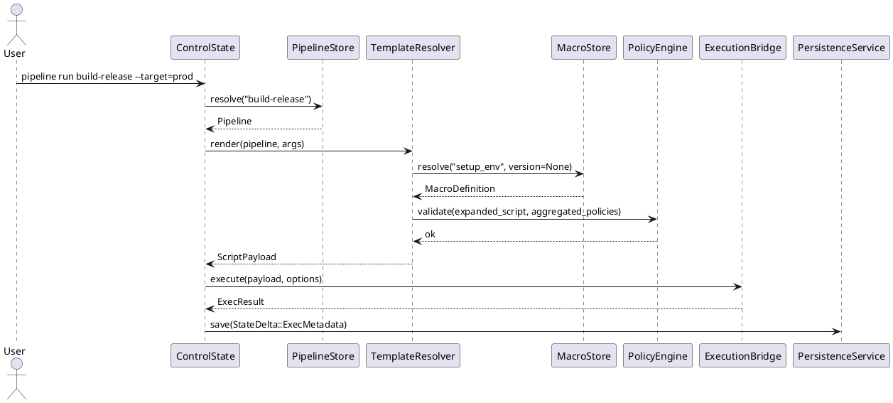
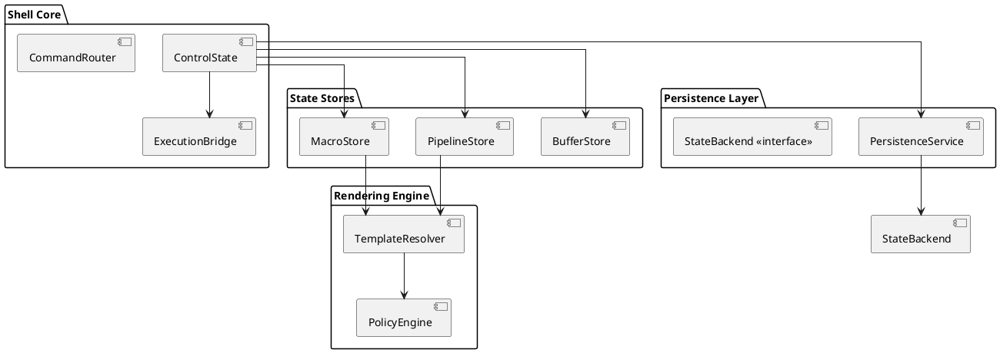
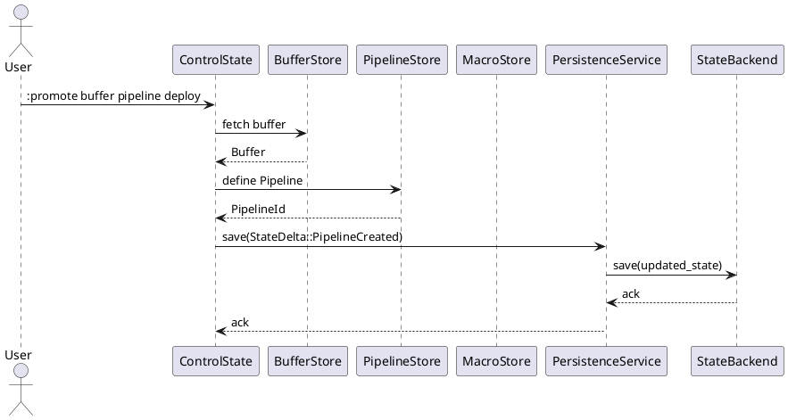

# Comprehensive Report — Integrated Scripting Suite

The integrated solution unifies Script Buffer Mode, Programmable Pipelines, persistent save-state ingest, and pipeline–macro execution into a cohesive shell scripting environment. The design enables users to prototype automation in buffers, promote reusable fragments to pipelines or macros, persist their tooling across sessions, and orchestrate complex workflows by composing pipelines and macros.

- **Script Buffer Mode** supplies a modal editing workspace for multi-line scripts with directives for execution, persistence, and validation.
- **Programmable Pipelines** treat reusable recipes as parameterized, policy-aware entities stored in a registry and invoked like builtins.
- **Macro Registry** captures fine-grained, parameterized snippets that can be called directly or embedded in pipelines, enabling hierarchical composition.
- **Persistent Save-State Ingest** snapshots buffers, pipelines, macros, user preferences, and runtime metadata to guarantee continuity across shell restarts.
- **Pipeline–Macro Integration** allows pipelines to invoke macros during template rendering, sharing validation policies and version controls.

## Core Architectural Components

- **ShellMode Controller** – Extends the control loop with `Prompt`, `Buffer`, `PipelineDef`, and `MacroDef` modes. Mode transitions occur via commands such as `:edit`, `pipeline define`, `macro define`, and `pipeline edit --buffer`, enabling context-aware input handling.
- **State Stores** – `BufferStore`, `PipelineStore`, and `MacroStore` maintain buffer content, pipeline definitions, and macro registries respectively. Each store tracks metadata (timestamps, exit status, provenance) and publishes changes to the persistence layer.
- **Persistence Service** – Consolidates state into versioned snapshots (SQLite, sled, or checksum-protected JSON/TOML). Provides immediate writes on critical events, background flushes, startup hydration, schema migration, and import/export tooling.
- **Execution Bridge** – Centralized executor that accepts rendered scripts, environment modifiers, and policy hints, launching commands via the process subsystem while capturing stdout/stderr and exit codes.
- **Template & Macro Resolver** – Renders pipelines with embedded macros, resolves dependency graphs, prevents recursion, enforces policy compatibility, performs placeholder substitution, and produces the final script payload.
- **Policy Engine** – Enforces sandbox rules (allowed commands, directories), approval requirements, and dry-run behavior, aggregating policies defined on pipelines and macros.

## Class Design (PlantUML)



## Key Function Prototypes (Language-Agnostic)

```text
function ControlState.handle_line(line: String) -> ControlFlow
function BufferStore.create(name: String) -> BufferId
function Buffer.append(line: String) -> void
function PipelineStore.define(def: PipelineDefinition) -> PipelineId
function PipelineStore.resolve(name: &str) -> Pipeline
function MacroStore.define(def: MacroDefinition) -> MacroId
function MacroStore.resolve(name: &str, version?: Int) -> Macro
function TemplateResolver.render(pipeline: &Pipeline, args: Map<String, Value>) -> ScriptPayload
function TemplateResolver.expandMacro(call: MacroCall) -> String
function PersistenceService.save(delta: StateDelta) -> void
function ExecutionBridge.execute(script: ScriptPayload, options: ExecOptions) -> ExecResult
```

## Persistence Workflow

### Snapshot Schema

- `state_version`: Int
- `buffers`: array of `{ id, name, body, metadata, origin }`
- `pipelines`: array of `{ id, name, params, body, metadata, policy, dependencies }`
- `macros`: array of `{ id, name, signature, body, metadata, versionHistory }`
- `user_settings`: prompt themes, default buffer, last active pipeline, etc.
- `runtime_info`: last run timestamps, aggregated metrics (optional).

### Save Triggers

- Explicit `:save-state`
- Mutating commands (`:promote`, `pipeline define`, `macro define`, `pipeline edit --publish`)
- Background flush interval
- Graceful exit (signal handlers)

### Startup Hydration

1. Load latest snapshot and verify checksum.
2. Apply migrations if schema version mismatches.
3. Rebuild indexes and dependency graphs.
4. Prime macro usage metrics and pipeline lint caches.

## Pipeline Execution with Macro Expansion



## Rust-Oriented Data Structures

```rust
pub struct BufferMetadata {
    pub created_at: DateTime<Utc>,
    pub updated_at: DateTime<Utc>,
    pub last_exit: Option<i32>,
    pub autosave_path: Option<PathBuf>,
    pub origin: Option<AssetOrigin>,
}

pub struct PipelineDefinition {
    pub name: String,
    pub signature: PipelineSignature,
    pub body: String,
    pub metadata: PipelineMetadata,
    pub policies: Vec<Policy>,
}

pub struct MacroDefinition {
    pub id: MacroId,
    pub name: String,
    pub signature: MacroSignature,
    pub body: String,
    pub policies: Vec<Policy>,
    pub version_history: Vec<MacroVersion>,
}

pub struct PersistentState {
    pub version: u32,
    pub buffers: Vec<BufferRecord>,
    pub pipelines: Vec<PipelineRecord>,
    pub macros: Vec<MacroRecord>,
    pub user_prefs: UserPreferences,
    pub runtime: RuntimeSnapshot,
}

pub enum Policy {
    CommandWhitelist(Vec<String>),
    DirectoryWhitelist(Vec<PathBuf>),
    RequireApproval,
    DryRunOnly,
    Custom(String),
}

pub struct ScriptPayload {
    pub text: String,
    pub metadata: ExecutionMetadata,
}

pub enum StateDelta {
    BufferCreated(BufferRecord),
    BufferUpdated(BufferRecord),
    BufferDeleted(BufferId),
    PipelineCreated(PipelineRecord),
    PipelineUpdated(PipelineRecord),
    MacroCreated(MacroRecord),
    MacroUpdated(MacroRecord),
    UserPrefsUpdated(UserPreferences),
    RuntimeUpdated(RuntimeSnapshot),
}
```

## Implementation & Testing Considerations

- **Unit Tests**: directive parsing, store CRUD, schema validation, macro binding, template rendering, persistence deltas.
- **Integration Tests**: interactive workflows (buffer → pipeline promotion → macro usage → execution → reload).
- **Policy Tests**: sandbox enforcement checks for combined pipeline/macro policies.
- **Persistence Tests**: snapshot creation, corruption recovery, schema upgrades.
- **Performance Tests**: large pipeline renders, macro-heavy expansions, save-state flush overhead.

## Deployment & Operations

- Feature toggles: `shell.script_buffer`, `shell.pipelines`, `shell.macros`, `shell.persistence`, `shell.scripting_suite`.
- Logging: snapshot events, validation errors, policy denials, macro dependency updates.
- Telemetry: adoption metrics (active buffers, pipeline executions, macro usage) for product insight.
- Rollout stages: buffer mode → pipelines/macros → integrated capabilities.

## Documentation & Support

- Guides for buffer directives, pipeline/macro definitions, promotion workflows, and persistence management.
- Troubleshooting for checksum failures, migration conflicts, recursive macro detection, policy violations.
- Reference cards with command syntax, placeholder formats, and policy options.

This comprehensive description complements the design sketches that follow and ensures the Markdown file captures both the narrative overview and the implementation-level details.

---

# Integrated Scripting Suite Design

This document details the combined Script Buffer, Programmable Pipeline, Macro, persistence, and pipeline–macro execution capabilities for the Iridium shell. It includes PlantUML diagrams (ready for rendering) and Rust-oriented type sketches illustrating the intended structure of a full implementation.

---

## 1. Architectural Overview

### 1.1 High-Level Component Diagram



### 1.2 Core Traits (Rust Sketch)

```rust
/// Shared behavior for all persisted script assets.
pub trait ScriptAsset {
    fn id(&self) -> &str;
    fn name(&self) -> &str;
    fn metadata(&self) -> &AssetMetadata;
}

/// Capability for assets that can be rendered and executed.
pub trait Executable {
    fn render(&self, ctx: &ExecutionContext) -> Result<ScriptPayload>;
    fn policies(&self) -> &[Policy];
}

/// Persistence contract for stateful components.
pub trait Persistable {
    fn serialize(&self) -> StateRecord;
}
```

---

## 2. Detailed Class Design

### 2.1 Class Diagram

```plantuml
@startuml
skinparam classAttributeIconSize 0

class ControlState {
  - mode: ShellMode
  - buffers: BufferStore
  - pipelines: PipelineStore
  - macros: MacroStore
  - persistence: PersistenceService
  - executor: ExecutionBridge
  + prompt(): String
  + handle_line(line: String): ControlFlow
  + switch_mode(new_mode: ShellMode)
}

enum ShellMode { Prompt; Buffer; PipelineDef; MacroDef }

class BufferStore {
  - items: HashMap<BufferId, Buffer>
  + create(name: String) : BufferId
  + get(id: BufferId) : Option<&Buffer>
  + list() : Vec<BufferSummary>
  + delete(id: BufferId)
}

class Buffer {
  + id: BufferId
  + name: String
  + body: Vec<String>
  + metadata: BufferMetadata
  + append(line: String)
  + insert(index: usize, line: String)
  + clear()
}

class PipelineStore {
  - items: HashMap<PipelineId, Pipeline>
  + define(def: PipelineDefinition) : PipelineId
  + update(id: PipelineId, def: PipelineDefinition)
  + resolve(name: &str) : Result<&Pipeline>
  + list() : Vec<PipelineSummary>
}

class Pipeline {
  + id: PipelineId
  + name: String
  + signature: PipelineSignature
  + body: String
  + policies: Vec<Policy>
  + dependencies: Vec<MacroDependency>
  + version: VersionId
  + render(ctx: &ExecutionContext) : Result<ScriptPayload>
}

class MacroStore {
  - items: HashMap<MacroId, MacroDefinition>
  + define(def: MacroDefinition) : MacroId
  + resolve(name: &str, version: Option<VersionId>) : Result<&MacroDefinition>
  + list() : Vec<MacroSummary>
}

class MacroDefinition {
  + id: MacroId
  + name: String
  + signature: MacroSignature
  + body: String
  + policies: Vec<Policy>
  + version_history: Vec<MacroVersion>
  + expand(args: &ArgBindings, ctx: &ExecutionContext) : Result<String>
}

class PersistenceService {
  - backend: Box<dyn StateBackend>
  - cache: PersistentState
  + load() : PersistentState
  + save(delta: StateDelta)
  + snapshot()
  + export(path: Path)
  + import(path: Path)
}

class StateBackend {
  <<interface>>
  + load() : Result<PersistentState>
  + save(state: &PersistentState) -> Result<()>
  + migrate(state: PersistentState, to_version: u32) : PersistentState
}

class TemplateResolver {
  - pipeline_store: PipelineStore
  - macro_store: MacroStore
  - policy_engine: PolicyEngine
  + render(pipeline: &Pipeline, args: &ArgBindings) : Result<ScriptPayload>
  + expand_macro(call: MacroCall, ctx: &RenderContext) : Result<String>
}

class PolicyEngine {
  + validate(script: &ScriptPayload, policies: &[Policy]) -> Result<()>
  + require_approval(policies: &[Policy]) -> bool
}

ControlState --> BufferStore
ControlState --> PipelineStore
ControlState --> MacroStore
ControlState --> PersistenceService
ControlState --> ExecutionBridge
Pipeline --> TemplateResolver
MacroDefinition --> TemplateResolver
TemplateResolver --> PolicyEngine
PersistenceService --> StateBackend
@enduml
```

### 2.2 Rust Struct Sketches

```rust
pub struct ControlState {
    mode: ShellMode,
    buffers: BufferStore,
    pipelines: PipelineStore,
    macros: MacroStore,
    persistence: PersistenceService,
    executor: ExecutionBridge,
}

impl ControlState {
    pub fn handle_line(&mut self, line: String) -> ControlFlow {
        // dispatch based on self.mode, persist deltas, return flow control
    }

    pub fn switch_mode(&mut self, new_mode: ShellMode) {
        self.mode = new_mode;
        // optional persistence hook
    }
}

pub struct BufferStore {
    items: HashMap<BufferId, Buffer>,
}

impl BufferStore {
    pub fn create(&mut self, name: impl Into<String>) -> BufferId { /* ... */ }
    pub fn list(&self) -> Vec<BufferSummary> { /* ... */ }
    pub fn get_mut(&mut self, id: &BufferId) -> Option<&mut Buffer> { /* ... */ }
}

pub struct PipelineStore {
    items: HashMap<PipelineId, Pipeline>,
}

impl PipelineStore {
    pub fn define(&mut self, def: PipelineDefinition) -> Result<PipelineId> { /* ... */ }
    pub fn resolve(&self, name: &str) -> Result<&Pipeline> { /* ... */ }
    pub fn list(&self) -> Vec<PipelineSummary> { /* ... */ }
}

pub struct MacroStore {
    items: HashMap<MacroId, MacroDefinition>,
}

impl MacroStore {
    pub fn define(&mut self, def: MacroDefinition) -> Result<MacroId> { /* ... */ }
    pub fn resolve(&self, name: &str, version: Option<VersionId>) -> Result<&MacroDefinition> { /* ... */ }
}
```

---

## 3. Persistence & Save-State Ingest

### 3.1 Persistence Workflow Sequence



### 3.2 State Schema (Rust Types)

```rust
pub struct PersistentState {
    pub version: u32,
    pub buffers: Vec<BufferRecord>,
    pub pipelines: Vec<PipelineRecord>,
    pub macros: Vec<MacroRecord>,
    pub user_prefs: UserPreferences,
    pub runtime: RuntimeSnapshot,
}

pub struct BufferRecord {
    pub id: BufferId,
    pub name: String,
    pub body: Vec<String>,
    pub metadata: BufferMetadata,
    pub origin: Option<AssetOrigin>,
}

pub struct PipelineRecord {
    pub id: PipelineId,
    pub name: String,
    pub signature: PipelineSignature,
    pub body: String,
    pub metadata: PipelineMetadata,
    pub policies: Vec<Policy>,
    pub dependencies: Vec<MacroDependency>,
    pub version: VersionId,
}

pub struct MacroRecord {
    pub id: MacroId,
    pub name: String,
    pub signature: MacroSignature,
    pub body: String,
    pub policies: Vec<Policy>,
    pub versions: Vec<MacroVersion>,
}
```

---

## 4. Pipeline–Macro Execution

### 4.1 Rendering Sequence Diagram


### 4.2 Macro-Aware Renderer (Rust Sketch)

```rust
impl TemplateResolver {
    pub fn render(&self, pipeline: &Pipeline, args: &ArgBindings) -> Result<ScriptPayload> {
        let rendered = self.render_body(&pipeline.body, args, &mut RenderContext::default())?;
        let script = ScriptPayload::new(rendered);
        self.policy_engine.validate(&script, pipeline.policies())?;
        Ok(script)
    }

    fn render_body(&self, body: &str, args: &ArgBindings, ctx: &mut RenderContext) -> Result<String> {
        // parse template, handle placeholders and macro invocations
    }

    fn expand_macro(&self, call: MacroCall, ctx: &mut RenderContext) -> Result<String> {
        let macro_def = self.macro_store.resolve(&call.name, call.version)?;
        let bound_args = macro_def.signature.bind(call.named_args)?;
        let rendered = macro_def.expand(&bound_args, ctx.execution_context)?;
        self.policy_engine.validate_macro(&rendered, macro_def.policies())?;
        Ok(rendered)
    }
}
```

---

## 5. Trait & Struct Inventory

```rust
// Buffer metadata
pub struct BufferMetadata {
    pub created_at: DateTime<Utc>,
    pub updated_at: DateTime<Utc>,
    pub last_exit: Option<i32>,
    pub autosave_path: Option<PathBuf>,
    pub origin: Option<AssetOrigin>,
}

pub struct BufferSummary {
    pub id: BufferId,
    pub name: String,
    pub lines: usize,
    pub last_exit: Option<i32>,
}

// Pipeline definitions
pub struct PipelineDefinition {
    pub name: String,
    pub signature: PipelineSignature,
    pub body: String,
    pub metadata: PipelineMetadata,
    pub policies: Vec<Policy>,
}

pub struct PipelineSignature {
    pub params: Vec<PipelineParam>,
}

pub struct PipelineParam {
    pub name: String,
    pub kind: ParamKind,
    pub default: Option<String>,
    pub validators: Vec<Validator>,
}

pub struct PipelineMetadata {
    pub description: Option<String>,
    pub version: VersionId,
    pub author: Option<String>,
    pub tags: Vec<String>,
}

// Macro definitions
pub struct MacroDefinition {
    pub id: MacroId,
    pub name: String,
    pub signature: MacroSignature,
    pub body: String,
    pub policies: Vec<Policy>,
    pub version_history: Vec<MacroVersion>,
}

pub struct MacroSignature {
    pub params: Vec<MacroParam>,
}

pub struct MacroParam {
    pub name: String,
    pub kind: ParamKind,
    pub default: Option<String>,
    pub validators: Vec<Validator>,
}

pub struct MacroVersion {
    pub version: VersionId,
    pub body: String,
    pub created_at: DateTime<Utc>,
    pub author: Option<String>,
}

pub struct MacroDependency {
    pub macro_name: String,
    pub version: Option<VersionId>,
}
```

---

## 6. Policy & Execution Types

```rust
pub enum Policy {
    CommandWhitelist(Vec<String>),
    DirectoryWhitelist(Vec<PathBuf>),
    RequireApproval,
    DryRunOnly,
    Custom(String),
}

pub struct ExecutionContext {
    pub env: HashMap<String, String>,
    pub working_dir: PathBuf,
    pub captures: Option<CaptureConfig>,
}

pub struct ScriptPayload {
    pub text: String,
    pub metadata: ExecutionMetadata,
}

pub struct ExecOptions {
    pub capture_stdout: bool,
    pub capture_stderr: bool,
    pub environment_overrides: HashMap<String, String>,
}

pub struct ExecResult {
    pub status: Option<i32>,
    pub stdout: Option<String>,
    pub stderr: Option<String>,
}
```

---

## 7. Persistence API (Rust Sketch)

```rust
impl PersistenceService {
    pub fn load(&mut self) -> Result<()> {
        let state = self.backend.load()?;
        self.cache = state;
        Ok(())
    }

    pub fn save(&mut self, delta: StateDelta) -> Result<()> {
        self.cache.apply(delta);
        self.backend.save(&self.cache)?;
        Ok(())
    }

    pub fn snapshot(&mut self) -> Result<()> {
        self.backend.save(&self.cache)
    }
}

pub enum StateDelta {
    BufferCreated(BufferRecord),
    BufferUpdated(BufferRecord),
    BufferDeleted(BufferId),
    PipelineCreated(PipelineRecord),
    PipelineUpdated(PipelineRecord),
    MacroCreated(MacroRecord),
    MacroUpdated(MacroRecord),
    UserPrefsUpdated(UserPreferences),
    RuntimeUpdated(RuntimeSnapshot),
}
```

---

## 8. Implementation Roadmap

1. Build the buffer, pipeline, and macro stores with CRUD operations and metadata updates.
2. Implement the persistence layer with a durable backend and delta-based saves.
3. Develop the template resolver and policy engine, including macro expansion and policy aggregation.
4. Wire control-state mode handling, execution flow, and persistence triggers.
5. Expose CLI commands (`:edit`, `:run`, `:promote`, `pipeline define`, `macro define`, etc.) that call into these services.
6. Create integration tests covering editing, promotion, macro invocation, execution, persistence, and reload workflows.

---

With these diagrams and Rust design sketches, the integrated scripting suite can be implemented as a cohesive, persistent, and extensible feature set inside the Iridium shell. The PlantUML blocks in this document can be rendered to image files, and the Rust snippets map directly to modules and traits you can flesh out during development.
